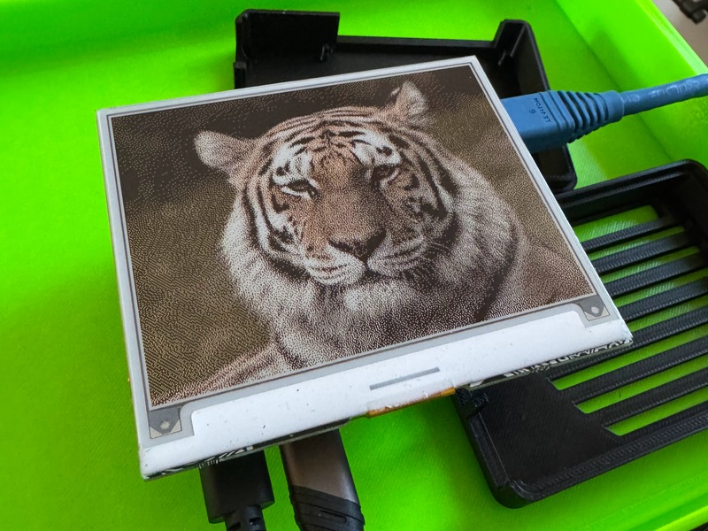

# tatted

This is a userspace driver for the JD79668 4-color 4.2" e-ink display controller. This is the controller used in the Pimoroni wHAT (wide hat) designed for the Raspberry Pi. This is a workspace crate which includes
* `libtatted` the high-level driver library, including image pre-processing
* `tatctl` a small CLI for controlling the display, rendering images, hardware resets, etc.

This crate makes heavy use of linux specifics for hardware peripheral manipulation, the display requires GPIOs, i2c, and SPI so the `target_os` for this project is linux only. All my testing of this crate has been using a Raspberry Pi 4 Model B running NixOS rather than Raspberry Pi OS, my NixOS configuration for the pi can be found [here](https://github.com/treyfortmuller/pi-nixos).

I built this thing with help from a now-archived Rust port of the Pimoroni [inky](https://github.com/pimoroni/inky) python library authored by Axel Örn Sigurðsson called [`paperwave`](https://crates.io/crates/paperwave). 

The datasheet/manual for the JD79668 can be found [here](https://files.waveshare.com/wiki/4.2inch%20e-Paper%20Module%20(G)/4.2inch_e-Paper_(G).pdf).

### CLI

#### Help Menu

```
$ tatctl --help

Usage: tatctl [OPTIONS] <COMMAND>

Commands:
  probe    Probe the system for the required peripheral devices, print results and exit
  display  Display manipulation and rendering
  image    Image pre-processing steps for e-ink rendering
  help     Print this message or the help of the given subcommand(s)

Options:
  -d, --debug    Turn debugging information on
  -h, --help     Print help
  -V, --version  Print version
```

#### Probe Subcommand

The `probe` subcommand auto-discovers all the GPIO chips, i2c buses, and SPI devices available on the host and attempts to take ownership:

```
$ tatctl probe

Probing peripherals...
GPIOs:
+----------------+------------------------------------------------------------+
| /dev/gpiochip0 | name: gpiochip0, label: pinctrl-bcm2711, num_lines: 58     |
+----------------+------------------------------------------------------------+
| /dev/gpiochip1 | name: gpiochip1, label: raspberrypi-exp-gpio, num_lines: 8 |
+----------------+------------------------------------------------------------+
i2c buses:
+------------+-----------------------------+
| /dev/i2c-1 | Successfully opened I2C bus |
+------------+-----------------------------+
SPI devices:
+----------------+--------------------------------+
| /dev/spidev0.0 | Successfully opened SPI device |
+----------------+--------------------------------+
Done.
```

#### Image Subcommand

The `image` subcommand allows you to run the image pre-processing pipeline (color quantization into the supported color palettes, and optional dithering) for arbitrary images, without attempting to interact with a connected display.

Here's an input image of a tiger with arbitrary color space:


Running

```
$ tatctl image -i ./imgs/tiger.jpg -c inky-four-color
```

yields an undithered result, color quantized into the black/white/yellow/red color palette of the display:


Adding a `--dither` flag enables Floyd-Steinberg dithering into the same colorspace.

```
$ tatctl image -i ./imgs/tiger.jpg -c inky-four-color
```


#### Display Subcommand

The `display` subcommand allows for interacting with a connected display. A hardware-rest is possible (although this won't generally change what is currently rendered on the display), as well as clearing the display, rendering a solid color in the supported palette, and rendering an arbitrary image (given that it is the correct resolution) using the same image processing pipeline as is used above.

```
$ tatctl display --help

Display manipulation and rendering

Usage: tatctl display <COMMAND>

Commands:
  reset         Perform a hardware reset on the display
  clear         Clear the display, all white pixels
  render-image  Render an arbitrary image
  render-color  Render a solid color
  help          Print this message or the help of the given subcommand(s)

Options:
  -h, --help  Print help
```

Here's what the dithered image from above looks like rendered on the display:


